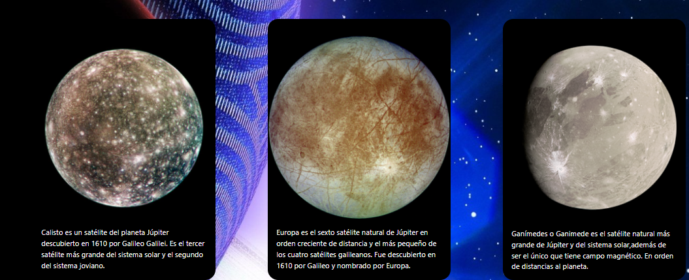
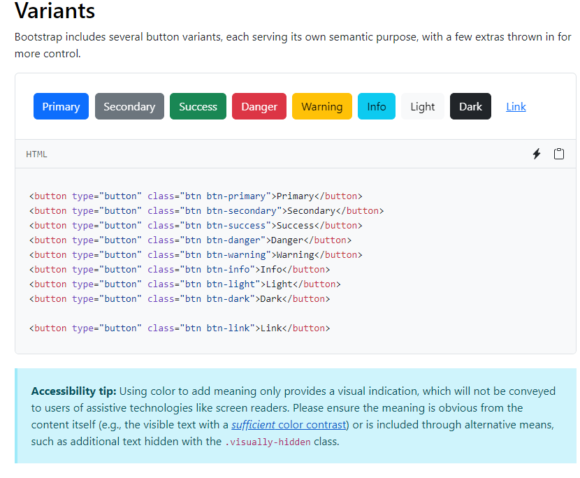
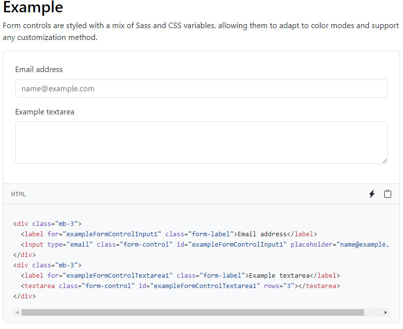
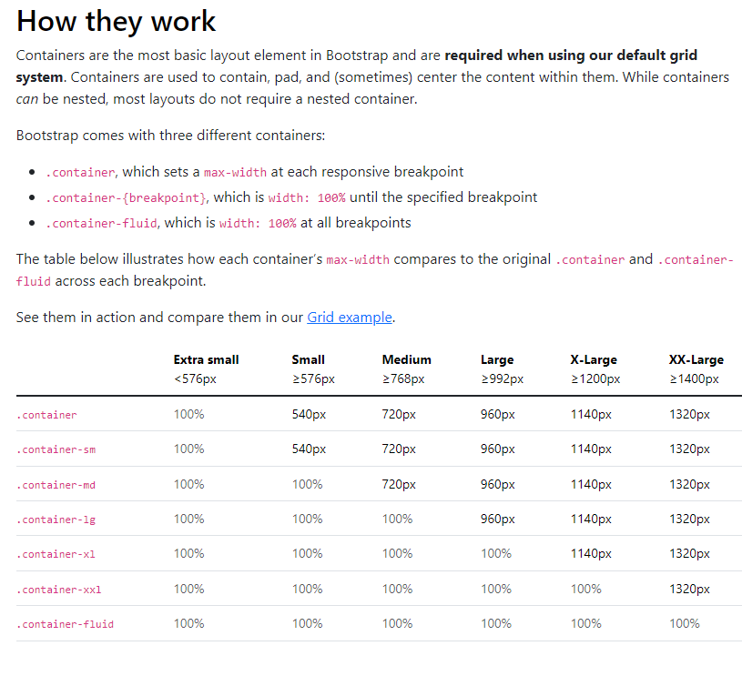

# BOOTSTRAP en HTML y CSS

## ¿Que es Bootstrap?

Bootstrap es un framework de código abierto para el desarrollo rápido y sencillo de sitios web y aplicaciones web responsivas. Proporciona un conjunto de herramientas front-end,como plantillas de diseño,tipografías,formularios,botones y componentes interactivos y permiten a los desarrolladores crear interfaces de usuario atractivas y funcionales de manera eficiente.

## ¿Que es un Framework?

Un framework es una estructura o conjunto de herramientas predefinidas que facilitan la creación de sitios web y aplicaciones web al proporcionar funciones y abstracciones comunes específicamente para este propósito. Los frameworks pueden incluir bibliotecas,plantillas,convenciones de codificación y otros componentes que aceleran el proceso de desarrollo al evitar que los desarrolladores tengan que reinventar la rueda cada vez que escriben código. Además, los frameworks suelen promover buenas prácticas de programación y estandarizar ciertos aspectos del desarrollo,lo que facilita la colaboración en equipos y la mantenibilidad a largo plazo de los proyectos.

# Componentes Usado en Bootstrap

Este repositorio contiene ejemplos de diferentes componentes de Bootstrap,como navbar,cards,botones y más.

## Lista de Componentes 

- Navbar
- Cards
- Botones
- Formularios
- Carruseles

## Navbar 

En Bootstrap, un "navbar" (barra de navegación) es un componente utilizado para crear menús de navegación responsivos y fácilmente personalizables. Es una barra horizontal que generalmente se coloca en la parte superior de una página web y contiene elementos como enlaces de navegación, botones de inicio de sesión, logotipos de marca, etc.

El navbar de Bootstrap está diseñado para adaptarse a diferentes tamaños de pantalla,desde dispositivos móviles hasta computadoras de escritorio y se ajusta automáticamente para brindar una experiencia de usuario coherente en todos los dispositivos.

## Cards

En Bootstrap,los cards son componentes flexibles que se utilizan para mostrar contenido de manera organizada y atractiva. Los cards son contenedores que pueden contener una variedad de contenido como por ejemplo,imágenes,texto,enlaces, botones,listas,etc. lo bueno de los cards que presentan información de manera clara y estructurada en tu página web.

## botones

Los botones en Bootstrap son elementos de interfaz de usuario utilizados para realizar acciones o activar funcionalidades en una página web. Son componentes interactivos que los usuarios pueden hacer clic para realizar una acción como por ejemplo,formulario,abrir un enlace,etc. Bootstrap proporciona una variedad de estilos y opciones para personalizar los botones y adaptarlos a las necesidades de tu proyecto.

## Formularios

Los formularios en Bootstrap son elementos utilizados para obtener datos del usuario en una página web. Permiten a los usuarios ingresar información como por ejemplo,texto,números,archivos, etc. Pueden ser enviados a un servidor para su procesamiento. Bootstrap ofrece una amplia gama de estilos y componentes para ayudar a diseñar y crear formularios de manera rápida y eficiente.

## Carruseles

Los carruseles en Bootstrap son componentes interactivos que permiten mostrar una serie de imágenes o contenido de manera dinámica en una página web. También se conocen como "sliders" o "carousels". Los carruseles son útiles para resaltar múltiples elementos de contenido de manera compacta y atractiva,ocupando un espacio limitado en la página y existen una variedad de tipo de carrousels en Bootstrap.

# Breakpoints en Bootstrap

## Contenedores diseñados por Bootstrap

Los contenedores son un componente fundamental de Bootstrap que contienen, rellenan y alinean su contenido dentro de un dispositivo o ventana gráfica determinado. Los contenedores son el elemento de diseño más básico en Bootstrap y son necesarios cuando utilizamos nuestro sistema de cuadrícula predeterminado. Los contenedores se utilizan para contener,rellenar y (a veces) centrar el contenido dentro de ellos. Si bien los contenedores se pueden anidar,la mayoría de los diseños no requieren un contenedor anidado.

Bootstrap viene con tres contenedores diferentes:

- .container: Establece un max-width cada punto de interrupción de respuesta.
- .container-{breakpoint}: es un width: 100% hasta el punto de interrupción especificado.
- .container-fluid: está width: 100% en todos los puntos de interrupción.

La siguiente tabla ilustra cómo se compara cada contenedor max-width el original .containery .container-fluid cada punto de interrupción.

